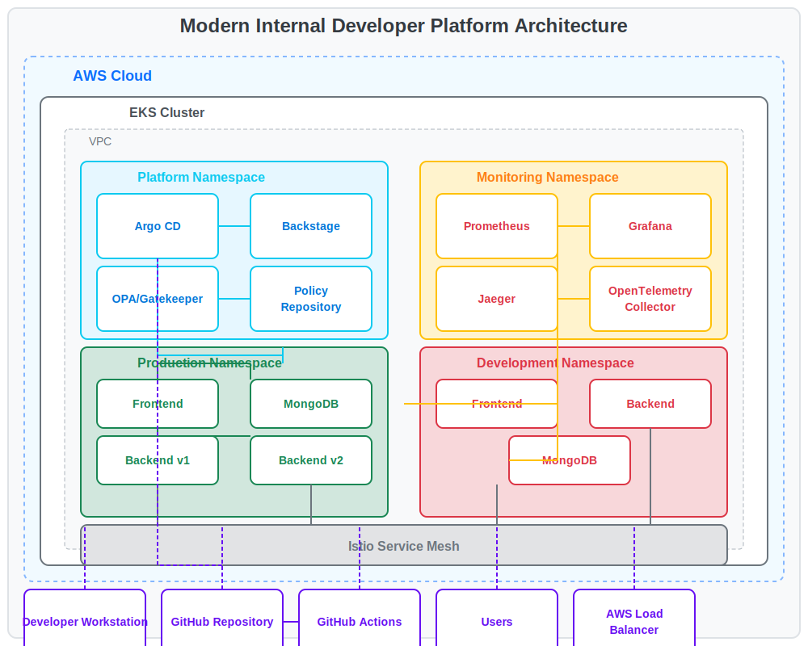

# Todo Application with Modern Internal Developer Platform

This repository contains a full-stack Todo application with a comprehensive Modern Internal Developer Platform (IDP) implementation. The platform follows DevOps best practices and provides a complete environment for development, deployment, monitoring, and management.

## Table of Contents

- [Architecture Overview](#architecture-overview)
- [Platform Components](#platform-components)
- [Application Components](#application-components)
- [Prerequisites](#prerequisites)
- [Local Development](#local-development)
- [Cloud Deployment](#cloud-deployment)
- [Observability](#observability)
- [Platform Usage Guide](#platform-usage-guide)
- [Project Structure](#project-structure)
- [Troubleshooting](#troubleshooting)

## Architecture Overview



The platform architecture integrates multiple components to provide a comprehensive developer experience:

- **Developer Portal** (Backstage) for service discovery and documentation
- **GitOps Workflow** with Argo CD for continuous deployment
- **Policy Enforcement** with OPA/Gatekeeper for governance
- **Observability Stack** for monitoring and troubleshooting
- **Service Mesh** (Istio) for traffic management and security
- **CI/CD Pipeline** with GitHub Actions

## Platform Components

### Developer Portal (Backstage)

Our Backstage instance serves as the central hub for developers to discover and interact with services:

- Service catalog
- API documentation
- Technical documentation
- Service templates

### GitOps with Argo CD

We follow GitOps principles using Argo CD:

- Infrastructure and application configuration stored in Git
- Automated synchronization between Git and the cluster
- Self-healing capabilities
- Deployment history and rollback

### Policy Enforcement with OPA/Gatekeeper

We enforce organizational policies using OPA/Gatekeeper:

- Resource requirements
- Security policies
- Labeling standards
- Best practices

### Observability Stack

Comprehensive observability is provided through:

- Prometheus for metrics collection
- Grafana for visualization
- Jaeger for distributed tracing
- OpenTelemetry for instrumentation

## Application Components

The Todo application consists of:

- **Frontend**: React application with OpenTelemetry instrumentation
- **Backend**: Node.js/Express API with MongoDB integration
- **Database**: MongoDB for data persistence

The application is containerized with Docker and deployed to Kubernetes with multiple environment support (dev/prod).

## Prerequisites

- [Node.js](https://nodejs.org/) (v16+)
- [Docker](https://www.docker.com/get-started) and [Docker Compose](https://docs.docker.com/compose/install/)
- [kubectl](https://kubernetes.io/docs/tasks/tools/)
- [Terraform](https://www.terraform.io/downloads.html) (v1.0+)
- [Helm](https://helm.sh/docs/intro/install/)
- [AWS CLI](https://aws.amazon.com/cli/) (configured with appropriate permissions)
- [ArgoCD CLI](https://argo-cd.readthedocs.io/en/stable/cli_installation/) (optional)
- [Istioctl](https://istio.io/latest/docs/setup/getting-started/#download) (optional)

## Local Development

### Clone the Repository

```bash
git clone https://github.com/AbubakarMahmood1/DevOpsAssignment.git
cd todo-app
```

### Start with Docker Compose

The easiest way to run the application locally is using Docker Compose:

```bash
docker compose up
```

This will start the frontend, backend, and MongoDB services. The application will be available at:
- Frontend: http://localhost:5173
- Backend API: http://localhost:5000

### Manual Setup

If you prefer to run the services individually:

#### Backend

```bash
cd backend
npm install
npm run dev
```

#### Frontend

```bash
cd frontend
npm install
npm run dev
```

#### MongoDB

You can either use a local MongoDB installation or run it with Docker:

```bash
docker run -d -p 27017:27017 --name mongodb mongo:latest
```

## Cloud Deployment

### Deployment Demo

Below are screenshots of the application deployment and monitoring dashboards:

#### Application Frontend


#### Grafana Dashboard


#### Jaeger Tracing


> Note: These are placeholder images. In a real submission, you would include actual screenshots of your running application and dashboards.

### Infrastructure Provisioning with Terraform

```bash
# Initialize Terraform
cd terraform
terraform init

# Preview changes
terraform plan -out=tfplan

# Apply changes
terraform apply tfplan
```

This will provision:
- VPC with public and private subnets
- EKS cluster with node groups
- IAM roles and policies
- Load balancer controller

### Kubernetes Deployment with Helm

After the infrastructure is provisioned, configure kubectl to use the new cluster:

```bash
aws eks update-kubeconfig --name todo-app-cluster --region us-east-1
```

Deploy the application using Helm:

```bash
# For development environment
helm install todo-app ./charts/todo-app -f ./charts/todo-app/values-dev.yaml -n dev

# For production environment
helm install todo-app ./charts/todo-app -f ./charts/todo-app/values-prod.yaml -n prod
```

## Observability

For detailed observability setup instructions, refer to [observability.md](observability.md).

### Quick Setup

To deploy the observability stack:

```bash
# Create monitoring namespace
kubectl apply -f kubernetes/monitoring/namespace.yaml

# Deploy monitoring components
kubectl apply -f kubernetes/monitoring/prometheus-deployment.yaml
kubectl apply -f kubernetes/monitoring/grafana-deployment.yaml
kubectl apply -f kubernetes/monitoring/otel-collector-deployment.yaml
kubectl apply -f kubernetes/monitoring/jaeger-deployment.yaml

# Deploy ingress for monitoring tools
kubectl apply -f kubernetes/monitoring/monitoring-ingress.yaml
```

### Accessing Dashboards

After deployment, you can access the dashboards at:

- Grafana: http://grafana.monitoring.local (Default credentials: admin/admin123)
- Prometheus: http://prometheus.monitoring.local
- Jaeger: http://jaeger.monitoring.local

Note: You may need to add entries to your hosts file to resolve these domains locally.

## Platform Usage Guide

### Deploying the Platform

To deploy the entire platform components:

```bash
# Run the platform deployment script
./deploy-platform.sh
```

This script will deploy:
- ArgoCD for GitOps
- Backstage developer portal
- OPA/Gatekeeper for policy enforcement
- Platform namespace and configurations

### Accessing Backstage

```bash
# Port-forward the Backstage service
kubectl port-forward -n platform svc/backstage 3000:80
```

Access the developer portal at: http://localhost:3000

### Working with ArgoCD

```bash
# Port-forward the ArgoCD service
kubectl port-forward svc/argocd-server -n argocd 8080:443
```

Access ArgoCD at: https://localhost:8080

Default username: admin  
Password: (Retrieve with `kubectl -n argocd get secret argocd-initial-admin-secret -o jsonpath="{.data.password}" | base64 -d`)

### Policy Management

View applied policies:

```bash
kubectl get constrainttemplates
kubectl get constraints
```

## Deployment Verification

To verify a successful deployment without actual AWS resources, you can follow these steps:

1. **Validate Terraform Configuration**
   ```bash
   cd terraform
   terraform validate
   ```
   This will check that your Terraform files are syntactically correct and internally consistent.

2. **Validate Kubernetes Resources**
   ```bash
   # Validate Helm charts
   helm lint ./charts/todo-app
   
   # Check Kubernetes manifests
   kubectl apply --dry-run=client -f kubernetes/dev/
   kubectl apply --dry-run=client -f kubernetes/prod/
   kubectl apply --dry-run=client -f kubernetes/platform/
   ```

3. **Run Local Simulations**
   You can use tools like [localstack](https://github.com/localstack/localstack) for AWS services and [kind](https://kind.sigs.k8s.io/) or [minikube](https://minikube.sigs.k8s.io/) for Kubernetes to test your configurations locally.

4. **Document Expected Results**
   In a production environment, the application would be accessible via the load balancer URL provided by the AWS ALB Ingress Controller:
   - Frontend: https://prod.myapp.local
   - Backend API: https://api.prod.myapp.local
   - Developer Portal: https://backstage.platform.myapp.local
   - ArgoCD: https://argocd.platform.myapp.local
   - Monitoring: https://grafana.monitoring.myapp.local, https://prometheus.monitoring.myapp.local, https://jaeger.monitoring.myapp.local

## Project Structure

```
todo-app/
├── backend/                # Node.js Express backend
│   ├── Dockerfile
│   ├── server.js
│   ├── tracing.js          # OpenTelemetry configuration
│   └── package.json
├── frontend/               # React frontend
│   ├── Dockerfile
│   ├── src/
│   │   ├── App.jsx
│   │   ├── TodoList.jsx
│   │   └── tracing.js      # OpenTelemetry configuration
│   └── package.json
├── kubernetes/             # Kubernetes configuration files
│   ├── dev/                # Development environment
│   ├── prod/               # Production environment
│   ├── monitoring/         # Observability stack
│   └── platform/           # Platform components
│       ├── backstage/      # Backstage configurations
│       ├── policies/       # OPA/Gatekeeper policies
│       └── argocd/         # ArgoCD configurations
├── terraform/              # Terraform infrastructure as code
│   ├── main.tf
│   └── variables.tf
├── charts/                 # Helm charts
│   └── todo-app/
│       ├── templates/
│       ├── values.yaml
│       ├── values-dev.yaml
│       └── values-prod.yaml
├── backstage/              # Backstage configuration
│   └── catalog/            # Backstage catalog entities
├── docs/                   # Documentation
│   ├── platform-architecture.svg
│   └── platform-integration.md
├── .github/workflows/      # GitHub Actions CI/CD
│   └── ci.yaml
├── compose.yaml            # Docker Compose for local development
├── deploy-platform.sh      # Platform deployment script
├── observability.md        # Observability setup documentation
└── README.md               # This readme file
```

## Troubleshooting

### Common Issues

1. **Application not starting locally**
   - Check if MongoDB is running and accessible
   - Verify environment variables are set correctly
   - Check for port conflicts

2. **OpenTelemetry not sending data**
   - Ensure the OTEL_EXPORTER_OTLP_ENDPOINT is correctly set
   - Check if the OpenTelemetry Collector is running
   - Verify network connectivity between components

3. **Terraform errors during provisioning**
   - Verify AWS credentials are configured correctly
   - Check if the specified AWS region supports all required services
   - Ensure you have sufficient permissions to create resources

4. **ArgoCD synchronization issues**
   - Check if the Git repository is accessible
   - Verify the application manifests are valid
   - Review ArgoCD logs: `kubectl logs -n argocd deployment/argocd-server`

5. **Backstage catalog not loading**
   - Verify catalog YAML files are valid
   - Check Backstage logs: `kubectl logs -n platform deployment/backstage`
   - Ensure GitHub repository URLs are correct

6. **Policy violations**
   - Review the policy constraints with `kubectl get constraints`
   - Check for violations with `kubectl get constraints -o yaml`
   - Modify your resources to comply with policies

For more detailed troubleshooting guidance, refer to the [observability.md](observability.md) file.

## License

This project is licensed under the MIT License - see the LICENSE file for details.